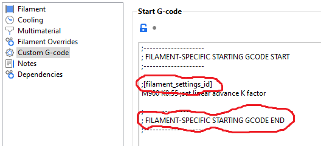

This is a small python script meant to isolate a tool change inside a gcode file in order to easily test the filament ramming and cooling settings
This means that in order to test those slice settings you can now slice the models provided (or any model for that matter, having a small gcode file just helps with the processing time) using two different extruders and save the gcode file as test.gcode (replacing the file that is currently in this folder) you can then run the python script which will overwrite the second file TipTest.gcode. You can then load that file(TipTest.gcode) on your sd card and run it on your printer. When running it the printer should heat up to the chosen temperature and perform a small extrusion then perform the ramming and cooling sequence, followed by a quick retraction to keep the filament far from the melt-zone and keep the tip as is.

3 changes in this version:
- Beginning and ending line numbers of the original input file are captured and annotated as a comment in the output file
- Slicer filament settings embedded in the original input file are captured and annotated as comments in the output file (all settings with the beginning word "filament")
- With a minor slicer adjustment to the filament profile custom gcode, the filament profile for the filament being tested is also captured and annotated as a comment in the output file

To get the filament profile name to work, add the upper circled text in your slicer's filament profile custom gcode field followed exactly 4 lines below by the lower circled text.  The trigger text and line offset (4 in this case) is contained in the python script in lines 47 and 48 if they need to be changed/adjusted for your setup.

